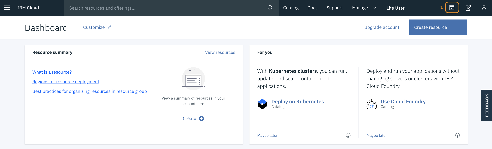

## 0. Workshop Setup
1. Go to this link and create an IBM Cloud Account: https://ibm.biz/BdqRFh.

2. If you already have an account, go to the same [link](https://ibm.biz/BdqRFh) and click **Log in** on the top right of the page to continue.

3. Once logged in, open an IBM Cloud Shell by clicking (1)

	

	and wait until the session is ready to use.

4. The default region for the shell is `us-south`. Europe based Lite Account users have `eu-gb` as their region. If necessary, switch region by typing:

	```
	ibmcloud target -r <your_region>
	```

	where `<your_region>` is the value of the region your need to switch to. Contact the workshop organiser if you're not sure what your region is.  

5. Next, complete the IBM Cloud CLI configuration by typing:

	```
	ibmcloud target --cf
	```

6. Make sure you select the IBM Cloud Shell tab in your browser. On the command line clone the repo by typing:

	```
	git clone https://github.com/eciggaar/go-serverless-with-java.git
	```

7. Change directory to the cloned repo:

	```
	cd go-serverless-with-java
	``` 	

<p  align="center">
	<font size="4">
 		<a href="README.md"><< Back</a>&nbsp;&nbsp;&nbsp;&nbsp;<a href="README.md">Index</a>&nbsp;&nbsp;&nbsp;&nbsp;<a href="STEP1.md">Next >></a></td>
 </font>
</p>
